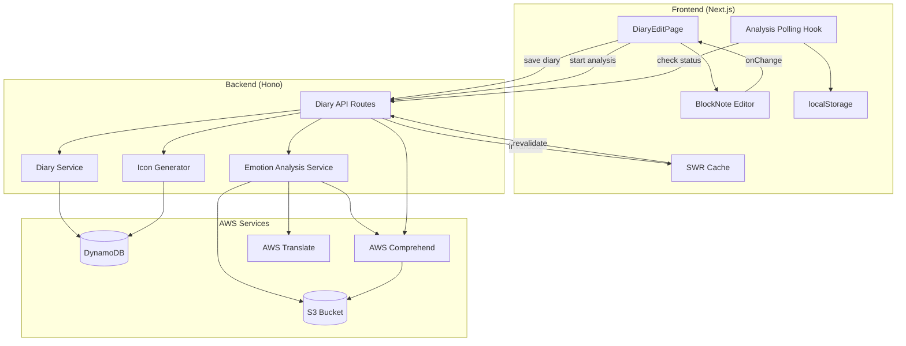
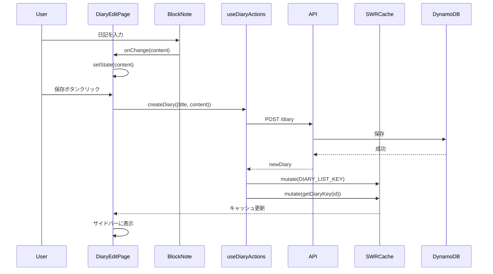
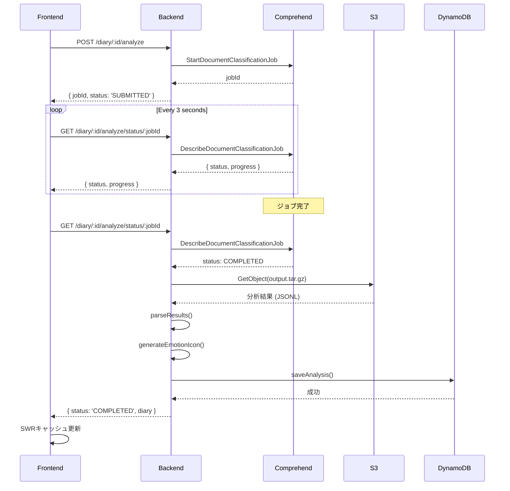
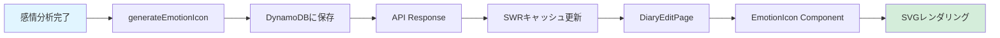

# Design: Diary UI Persistence and Emotion Analysis Fixes

**Feature Name:** diary-ui-emotion-fixes
**Created:** 2025-11-06
**Status:** Draft

## Overview

This design document outlines the technical approach to fix critical issues in the diary application's content persistence, emotion analysis workflow, and icon generation. The solution leverages existing infrastructure (BlockNote, SWR, AWS Comprehend, DynamoDB) while addressing state management and data flow problems.

## System Architecture

### High-Level Architecture



## Component Design

### 1. BlockNote Editor Integration Fix

**Current Problem:**
- `BlockNoteEditor.onChange` is called but content state doesn't update properly in parent component
- Serialized content may not be included in save requests

**Solution:**

```typescript
// BlockNoteEditor.tsx (修正)
export default function BlockNoteEditorComponent({
  initialContent = '',
  onChange,
  placeholder = '今日はどんな一日でしたか？',
  editable = true
}: BlockNoteEditorProps) {
  const parsedInitialContent = useMemo(() => {
    if (!initialContent) return undefined;
    return parseContent(initialContent);
  }, [initialContent]);

  const editor = useCreateBlockNote({
    initialContent: parsedInitialContent,
  });

  // 修正: onChange を確実に呼び出す
  useEffect(() => {
    if (!onChange || !editor) return;

    const unsubscribe = editor.onChange(() => {
      const blocks = editor.document;
      const serialized = JSON.stringify(blocks);
      console.log('[BlockNote] Content changed:', serialized); // デバッグログ
      onChange(serialized);
    });

    return unsubscribe;
  }, [editor, onChange]);

  return (
    <div className="blocknote-editor-wrapper">
      <BlockNoteView editor={editor} editable={editable} theme="light" />
    </div>
  );
}
```

**Key Changes:**
- Add debug logging to verify onChange is called
- Ensure serialized content is always a valid JSON string
- Verify onChange prop is stable (no unnecessary re-renders)

### 2. Diary Save Flow Enhancement

**Current Problem:**
- Diary entries are saved to backend but don't appear in UI sidebar
- SWR cache may not be invalidated correctly

**Solution:**

```typescript
// useDiary.ts (修正)
export function useDiaryActions() {
  const [isCreating, setIsCreating] = useState(false);
  const [isUpdating, setIsUpdating] = useState(false);

  const createDiary = async (data: CreateDiaryRequest): Promise<DiaryEntry> => {
    setIsCreating(true);
    try {
      console.log('[useDiary] Creating diary with content length:', data.content?.length);
      const newDiary = await diaryRepository.createDiary(data);

      // 修正: キャッシュを確実に無効化
      await mutate(DIARY_LIST_KEY);  // await を追加
      await mutate(getDiaryKey(newDiary.id), newDiary, false);

      console.log('[useDiary] Diary created successfully:', newDiary.id);
      return newDiary;
    } finally {
      setIsCreating(false);
    }
  };

  const updateDiary = async (id: string, data: UpdateDiaryRequest): Promise<DiaryEntry | null> => {
    setIsUpdating(true);
    try {
      console.log('[useDiary] Updating diary:', id);
      const updatedDiary = await diaryRepository.updateDiary(id, data);

      if (updatedDiary) {
        // 修正: 両方のキャッシュを無効化
        await mutate(DIARY_LIST_KEY);
        await mutate(getDiaryKey(id), updatedDiary, false);
      }

      return updatedDiary;
    } finally {
      setIsUpdating(false);
    }
  };

  return { createDiary, updateDiary, isCreating, isUpdating, /* ... */ };
}
```

**Data Flow:**



### 3. Emotion Analysis Status Display

**Current Problem:**
- No visual feedback during analysis
- Status doesn't persist across page navigations

**Solution:**

```typescript
// DiaryEditPage.tsx (修正)
export function DiaryEditPage({ id }: DiaryEditPageProps) {
  // ... existing code ...

  const analysisJob = id ? getJobForDiary(id) : null;
  const isAnalyzing = !!analysisJob;
  const analysisProgress = analysisJob?.progress || 0;

  // 新規: より詳細なステータス表示
  const getAnalysisStatusMessage = () => {
    if (!analysisJob) return null;

    switch (analysisJob.status) {
      case 'SUBMITTED':
        return '感情分析を開始しています...';
      case 'IN_PROGRESS':
        return '感情を分析中...';
      case 'COMPLETED':
        return '分析が完了しました！';
      case 'FAILED':
        return '分析に失敗しました';
      default:
        return '処理中...';
    }
  };

  return (
    <div className="flex h-screen overflow-hidden">
      {/* ... existing code ... */}

      {/* 修正: より詳細な感情分析ステータス表示 */}
      {isAnalyzing && (
        <div className="mb-6 p-4 bg-gradient-to-r from-blue-50 to-indigo-50 border border-blue-200 rounded-lg shadow-sm">
          <div className="flex items-center gap-3 mb-3">
            <div className="animate-spin rounded-full h-5 w-5 border-2 border-blue-600 border-t-transparent" />
            <div className="flex-1">
              <span className="text-blue-900 font-medium block">
                {getAnalysisStatusMessage()}
              </span>
              <span className="text-xs text-blue-700">
                ジョブID: {analysisJob.jobId.slice(0, 8)}...
              </span>
            </div>
          </div>
          <div className="w-full bg-blue-200 rounded-full h-2.5 overflow-hidden">
            <div
              className="bg-gradient-to-r from-blue-600 to-indigo-600 h-full transition-all duration-500 ease-out"
              style={{ width: `${analysisProgress}%` }}
            />
          </div>
          <div className="flex justify-between items-center mt-2">
            <span className="text-sm text-blue-700">
              {analysisProgress < 100 ? `進行中 (${analysisProgress}%)` : '完了'}
            </span>
            {analysisJob.startedAt && (
              <span className="text-xs text-blue-600">
                開始: {new Date(analysisJob.startedAt).toLocaleTimeString('ja-JP')}
              </span>
            )}
          </div>
        </div>
      )}

      {/* ... rest of UI ... */}
    </div>
  );
}
```

### 4. Emotion Analysis Result Storage Fix

**Current Problem:**
- Comprehend results are not saved to DynamoDB
- Backend `/analyze/status` endpoint may not be updating diary records

**Solution:**

```typescript
// backend/src/routes/diary.ts (修正)
app.get('/:id/analyze/status/:jobId', async (c) => {
  try {
    const id = c.req.param('id');
    const jobId = c.req.param('jobId');

    console.log(`[Analyze Status] Checking job ${jobId} for diary ${id}`);

    const statusResult = await emotionAnalysisService.checkJobStatus(jobId);

    // 完了している場合は結果を取得して保存
    if (statusResult.status === 'COMPLETED') {
      console.log(`[Analyze Status] Job completed, fetching results...`);

      const emotionResult = await emotionAnalysisService.getJobResult(id, jobId);

      const analysis: EmotionAnalysis = {
        diaryId: id,
        ...emotionResult,
        analyzedAt: new Date().toISOString(),
      };

      // 修正: 分析結果を保存
      console.log('[Analyze Status] Saving analysis to DynamoDB:', analysis);
      await emotionAnalysisDBService.saveAnalysis(analysis);

      // 日記データを取得
      const diary = await diaryService.getDiary(id);
      if (!diary) {
        console.error(`[Analyze Status] Diary ${id} not found`);
        return c.json({ error: 'Diary not found' }, 404);
      }

      // アイコンデータを生成
      console.log('[Analyze Status] Generating emotion icon...');
      const iconData = generateEmotionIcon(analysis, parseInt(id.slice(-6), 16));

      console.log('[Analyze Status] Analysis complete with icon');
      return c.json({
        status: 'COMPLETED',
        diary: {
          ...diary,
          emotionAnalysis: analysis,
          iconData
        }
      });
    }

    // 進行中または失敗
    return c.json({
      status: statusResult.status,
      progress: statusResult.progress
    });
  } catch (error) {
    console.error('[Analyze Status] Error:', error);
    return c.json({ error: 'Failed to check analysis status' }, 500);
  }
});
```

**Analysis Result Flow:**



### 5. Icon Generation and Display

**Current Problem:**
- Icons are generated but may not be displayed correctly
- Icon component may not be receiving proper data

**Solution:**

```typescript
// backend/src/utils/emotionIcon.ts (検証と改善)
export function generateEmotionIcon(
  analysis: EmotionAnalysis,
  seed: number
): EmotionIconData {
  // 既存の実装を使用、ただしログを追加
  console.log('[IconGen] Generating icon for emotions:', analysis);

  const iconData: EmotionIconData = {
    // ... existing generation logic ...
  };

  console.log('[IconGen] Generated icon:', iconData);
  return iconData;
}
```

```typescript
// frontend/src/components/model/emotion/EmotionIcon.tsx (修正)
interface EmotionIconProps {
  icon: EmotionIconData;
  size?: number;
  className?: string;
}

export function EmotionIcon({ icon, size = 48, className = '' }: EmotionIconProps) {
  if (!icon) {
    console.warn('[EmotionIcon] No icon data provided');
    return null;
  }

  console.log('[EmotionIcon] Rendering icon with size:', size);

  return (
    <div
      className={`emotion-icon ${className}`}
      style={{ width: size, height: size }}
      title="感情アイコン"
    >
      {/* 既存のSVGレンダリングロジック */}
    </div>
  );
}
```

**Icon Display Flow:**



### 6. Background Polling Enhancement

**Current Problem:**
- Polling may not continue across page navigations
- Job state in localStorage may not be properly serialized

**Solution:**

```typescript
// frontend/src/usecases/diary/useAnalysisPolling.ts (修正)
export function useAnalysisPolling() {
  const [jobs, setJobs] = useState<AnalysisJob[]>([]);

  // マウント時にlocalStorageから読み込み
  useEffect(() => {
    const loaded = getJobsFromStorage();
    console.log('[AnalysisPolling] Loaded jobs from storage:', loaded);
    setJobs(loaded);
  }, []);

  // ジョブが変更されたらlocalStorageに保存
  useEffect(() => {
    console.log('[AnalysisPolling] Saving jobs to storage:', jobs);
    saveJobsToStorage(jobs);
  }, [jobs]);

  const pollJob = useCallback(async (job: AnalysisJob) => {
    try {
      console.log('[AnalysisPolling] Polling job:', job.jobId);
      const statusResponse = await diaryRepository.checkAnalysisStatus(job.diaryId, job.jobId);

      if (statusResponse.status === 'COMPLETED' && statusResponse.diary) {
        console.log('[AnalysisPolling] Job completed successfully');
        // キャッシュを更新してジョブを削除
        await mutate(DIARY_LIST_KEY);
        await mutate(getDiaryKey(job.diaryId), statusResponse.diary);
        removeJob(job.diaryId);
        return;
      }

      if (statusResponse.status === 'FAILED') {
        console.error(`[AnalysisPolling] Job failed for diary ${job.diaryId}`);
        removeJob(job.diaryId);
        return;
      }

      // 進行中 - ステータスを更新
      console.log('[AnalysisPolling] Job in progress:', statusResponse.status, statusResponse.progress);
      setJobs(prev => prev.map(j =>
        j.diaryId === job.diaryId
          ? { ...j, status: statusResponse.status as any, progress: statusResponse.progress || j.progress }
          : j
      ));
    } catch (error) {
      console.error(`[AnalysisPolling] Failed to poll job ${job.jobId}:`, error);
    }
  }, [removeJob]);

  // 定期的にすべてのジョブをポーリング
  useEffect(() => {
    if (jobs.length === 0) {
      console.log('[AnalysisPolling] No jobs to poll');
      return;
    }

    console.log('[AnalysisPolling] Starting polling interval for', jobs.length, 'jobs');
    const interval = setInterval(() => {
      jobs.forEach(job => {
        pollJob(job);
      });
    }, POLLING_INTERVAL);

    return () => {
      console.log('[AnalysisPolling] Clearing polling interval');
      clearInterval(interval);
    };
  }, [jobs, pollJob]);

  return { jobs, addJob, removeJob, getJobForDiary };
}
```

## Data Models

### Frontend Models (Existing - No Changes)

```typescript
// types/diary.ts
interface DiaryEntry {
  id: string;
  userId: string;
  title: string;
  content: string;  // BlockNote JSON format
  createdAt: Date;
  updatedAt: Date;
  emotionAnalysis?: EmotionAnalysis;
  iconData?: EmotionIconData;
}

interface EmotionAnalysis {
  diaryId: string;
  joy: number;
  trust: number;
  fear: number;
  surprise: number;
  sadness: number;
  disgust: number;
  anger: number;
  anticipation: number;
  analyzedAt: string;
}

// types/analysisJob.ts
interface AnalysisJob {
  diaryId: string;
  jobId: string;
  startedAt: Date;
  status: 'SUBMITTED' | 'IN_PROGRESS' | 'COMPLETED' | 'FAILED';
  progress: number;
}
```

### Backend Models (Existing - No Changes)

```typescript
// backend/src/types/index.ts
export interface DiaryEntry {
  id: string;
  userId: string;
  title: string;
  content: string;
  createdAt: string;
  updatedAt: string;
}

export interface EmotionAnalysis {
  diaryId: string;
  joy: number;
  trust: number;
  fear: number;
  surprise: number;
  sadness: number;
  disgust: number;
  anger: number;
  anticipation: number;
  analyzedAt: string;
}
```

## Integration Points

### 1. BlockNote ↔ DiaryEditPage
- **Interface**: `onChange(content: string)`
- **Data Format**: JSON string of BlockNote document structure
- **Fix**: Ensure onChange is called reliably and content state is updated

### 2. Frontend ↔ Backend API
- **Endpoints**:
  - `POST /diary` - Create diary
  - `PUT /diary/:id` - Update diary
  - `POST /diary/:id/analyze` - Start analysis
  - `GET /diary/:id/analyze/status/:jobId` - Check status
- **Fix**: Add comprehensive logging and error handling

### 3. Backend ↔ AWS Services
- **AWS Translate**: Japanese → English
- **AWS S3**: Store input text and output results
- **AWS Comprehend**: Custom classifier for emotions
- **Fix**: Ensure proper error handling and retries

### 4. Backend ↔ DynamoDB
- **Tables**: `Diaries`, `EmotionAnalysis`
- **Fix**: Verify saveAnalysis() is called after job completion

## Error Handling Strategy

### Frontend Error Handling

```typescript
// エラー表示用のトースト追加
const handleSave = async () => {
  try {
    await createDiary({ title, content });
    // 成功メッセージ（将来: トースト）
  } catch (error) {
    console.error('保存に失敗しました:', error);
    // エラーメッセージ表示（将来: トースト）
    alert('日記の保存に失敗しました。もう一度お試しください。');
  }
};
```

### Backend Error Handling

```typescript
// 各エンドポイントに詳細なエラーログ追加
app.post('/:id/analyze', async (c) => {
  try {
    // ... logic ...
  } catch (error) {
    console.error('Failed to start analysis job:', error);
    if (error instanceof Error) {
      console.error('Error details:', error.message, error.stack);
    }
    return c.json({
      error: 'Failed to start analysis job',
      details: error instanceof Error ? error.message : 'Unknown error'
    }, 500);
  }
});
```

## Testing Strategy

### Unit Tests (Out of Scope for This Fix)
- Test BlockNote onChange handler
- Test emotion icon generation
- Test localStorage serialization

### Integration Tests (Manual Testing)

1. **Diary Persistence Test**:
   - Create new diary with content
   - Verify appears in sidebar immediately
   - Navigate away and back
   - Verify content is preserved

2. **Emotion Analysis Test**:
   - Save diary with Japanese content
   - Verify analysis starts (progress indicator shows)
   - Wait for completion
   - Verify emotion icon and breakdown appear

3. **Background Polling Test**:
   - Start analysis
   - Navigate to different page
   - Return after 30 seconds
   - Verify results are shown

4. **Error Handling Test**:
   - Test with invalid AWS credentials
   - Test with empty content
   - Verify error messages are displayed

## Performance Considerations

### SWR Cache Optimization
- Use `mutate(key, data, false)` to update cache without revalidation
- Set `revalidateOnFocus: false` to reduce unnecessary requests
- Implement cache deduplication for concurrent requests

### Polling Optimization
- 3-second interval balances responsiveness and API costs
- Stop polling when no active jobs
- Clear completed jobs from localStorage immediately

### BlockNote Performance
- Lazy load BlockNote editor component
- Use `useMemo` for initial content parsing
- Prevent unnecessary re-renders with stable onChange callback

## Security Considerations

### AWS Credentials
- Store in environment variables only
- Never expose in client-side code
- Use IAM roles with least privilege

### Data Validation
- Validate diary content length (backend)
- Sanitize user input before storage
- Verify job IDs match expected format

### Authentication (Future)
- Currently using 'anonymous' user
- Future: Implement proper user authentication
- Ensure users can only access their own diaries

## Deployment Notes

### Environment Variables Required

```bash
# Backend (.env)
AWS_ACCESS_KEY_ID="..."
AWS_SECRET_ACCESS_KEY="..."
AWS_SESSION_TOKEN="..."  # If using temporary credentials
COMPREHEND_CLASSIFIER_ARN="arn:aws:comprehend:ap-northeast-1:223708988018:document-classifier/kibi-emotion-classifier"
CONTENT_BUCKET_NAME="kibi-content-223708988018"
COMPREHEND_DATA_ACCESS_ROLE_ARN="arn:aws:iam::223708988018:role/ComprehendDataAccessRole"

# Frontend (.env.local)
NEXT_PUBLIC_API_URL="http://localhost:8080"
```

### Deployment Steps

1. Set environment variables in backend
2. Restart backend server
3. Clear browser localStorage (for testing)
4. Test complete flow end-to-end
5. Monitor logs for any errors

## Monitoring and Debugging

### Key Log Points

```typescript
// Frontend
console.log('[BlockNote] Content changed:', serialized);
console.log('[useDiary] Creating diary with content length:', data.content?.length);
console.log('[AnalysisPolling] Polling job:', job.jobId);

// Backend
console.log('[Analyze Status] Checking job', jobId);
console.log('[Analyze Status] Saving analysis to DynamoDB:', analysis);
console.log('[IconGen] Generating icon for emotions:', analysis);
```

### Debug Checklist

1. ✅ BlockNote onChange is called
2. ✅ Content state is updated in DiaryEditPage
3. ✅ API request includes content field
4. ✅ Backend saves to DynamoDB
5. ✅ SWR cache is invalidated
6. ✅ Sidebar shows new entry
7. ✅ Analysis job starts
8. ✅ Polling continues
9. ✅ Results are saved to DynamoDB
10. ✅ Icon is generated and displayed

## Rollback Plan

If issues occur after deployment:

1. Revert code changes to previous commit
2. Clear localStorage on client
3. Verify backend is running previous version
4. Check DynamoDB for any corrupted records
5. Review CloudWatch logs for errors

## Future Enhancements (Out of Scope)

- Add toast notifications for success/error messages
- Implement retry logic for failed analysis jobs
- Add manual refresh button for analysis status
- Optimize icon generation algorithm
- Add unit and integration tests
- Implement proper user authentication
- Add analytics tracking for analysis completion rates

## References

- [BlockNote Documentation](https://www.blocknotejs.org/)
- [SWR Documentation](https://swr.vercel.app/)
- [AWS Comprehend Custom Classification](https://docs.aws.amazon.com/comprehend/latest/dg/how-document-classification.html)
- [Next.js Dynamic Imports](https://nextjs.org/docs/advanced-features/dynamic-import)
